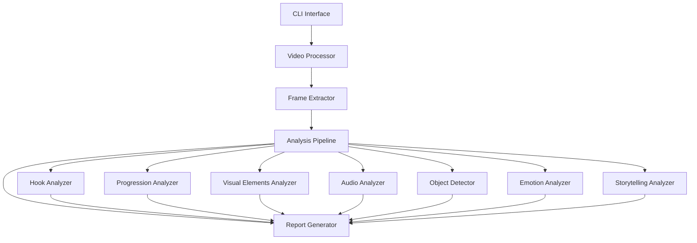

# Design Document: Video Analyzer

## Overview

The Video Analyzer is an AI-powered system designed to provide in-depth analysis of video content. It leverages PyDantic-AI agents, OpenAI's large language models, and computer vision technologies to analyze various aspects of videos including hooks, progression, visual elements, audio, objects, emotional impact, and storytelling techniques. The system aims to help content creators learn from existing videos to create more engaging content.

## Architecture

The system follows a modular architecture with the following high-level components:



### Core Components

1. **CLI Interface**: A Typer-based command-line interface for user interaction.
2. **Video Processor**: Handles video input, validation, and preprocessing.
3. **Frame Extractor**: Extracts frames from the video at appropriate intervals.
4. **Analysis Pipeline**: Orchestrates the various analyzers.
5. **Analyzers**: Specialized modules for different aspects of video analysis.
6. **Report Generator**: Compiles analysis results into a comprehensive report.

## Components and Interfaces

### 1. User Interface

#### CLI Interface (Typer)

```python
@app.command()
def analyze(
    video_path: Path = typer.Argument(..., help="Path to the video file"),
    output_format: str = typer.Option("json", help="Output format (json, html, pdf)"),
    verbose: bool = typer.Option(False, help="Enable verbose output"),
    analysis_depth: str = typer.Option("standard", help="Analysis depth (quick, standard, deep)"),
) -> None:
    """
    Analyze a video file and generate a detailed report.
    """
    # Implementation
```

### 2. Video Processor

```python
class VideoProcessor:
    """
    Handles video input, validation, and preprocessing.
    """

    def __init__(self, config: VideoProcessorConfig):
        self.config = config

    def validate_video(self, video_path: Path) -> ValidationResult:
        """
        Validate the video file format and size.
        """
        # Implementation

    def preprocess_video(self, video_path: Path) -> ProcessedVideo:
        """
        Preprocess the video for analysis.
        """
        # Implementation
```

### 3. Frame Extractor

```python
class FrameExtractor:
    """
    Extracts frames from the video at appropriate intervals.
    """

    def __init__(self, config: FrameExtractorConfig):
        self.config = config

    def extract_frames(self, video_path: Path, strategy: str = "uniform") -> List[Frame]:
        """
        Extract frames from the video using the specified strategy.

        Strategies:
        - uniform: Extract frames at uniform intervals
        - scene_change: Extract frames at scene changes
        - keyframe: Extract keyframes
        """
        # Implementation
```

### 4. Analysis Pipeline

```python
class AnalysisPipeline:
    """
    Orchestrates the various analyzers.
    """

    def __init__(self, config: AnalysisPipelineConfig):
        self.config = config
        self.analyzers = []

    def register_analyzer(self, analyzer: BaseAnalyzer) -> None:
        """
        Register an analyzer with the pipeline.
        """
        self.analyzers.append(analyzer)

    async def run_analysis(self, video_data: VideoData) -> AnalysisResult:
        """
        Run all registered analyzers on the video data.
        """
        # Implementation
```

### 5. Analyzers

#### Base Analyzer

```python
class BaseAnalyzer(ABC):
    """
    Base class for all analyzers.
    """

    @abstractmethod
    async def analyze(self, video_data: VideoData) -> AnalysisResult:
        """
        Analyze the video data.
        """
        pass
```

#### Hook Analyzer

```python
class HookAnalyzer(BaseAnalyzer):
    """
    Analyzes the hook section of the video.
    """

    async def analyze(self, video_data: VideoData) -> HookAnalysisResult:
        """
        Analyze the hook section of the video.
        """
        # Implementation using OpenAI LLM to identify hook techniques
        # Identify the hook section (typically first 5-15 seconds)
        # Evaluate hook effectiveness based on pacing, visuals, and audio
        # Provide timestamps for key moments
        # Compare hook strategies across different content when applicable
```

#### Progression Analyzer

```python
class ProgressionAnalyzer(BaseAnalyzer):
    """
    Analyzes the progression and structure of the video.
    """

    async def analyze(self, video_data: VideoData) -> ProgressionAnalysisResult:
        """
        Analyze the progression of the video.
        """
        # Break down video into distinct sections/segments
        # Identify pacing changes throughout the video
        # Detect transitions between topics or scenes
        # Evaluate narrative flow and coherence
        # Provide insights on retention strategies
```

#### Visual Elements Analyzer

```python
class VisualElementsAnalyzer(BaseAnalyzer):
    """
    Analyzes visual aspects of the video.
    """

    async def analyze(self, video_data: VideoData) -> VisualAnalysisResult:
        """
        Analyze the visual elements of the video.
        """
        # Evaluate lighting techniques and quality
        # Identify color schemes and their emotional impact
        # Detect camera movements and framing techniques
        # Recognize visual effects and their purpose
        # Provide recommendations for visual improvements
```

#### Audio Analyzer

```python
class AudioAnalyzer(BaseAnalyzer):
    """
    Analyzes audio and speech elements of the video.
    """

    async def analyze(self, video_data: VideoData) -> AudioAnalysisResult:
        """
        Analyze the audio elements of the video.
        """
        # Evaluate sound quality and clarity
        # Assess speech pacing, tone, and delivery style
        # Identify background music and its emotional effect
        # Detect sound effects and their purpose
        # Transcribe speech for further analysis
```

#### Object Detector

```python
class ObjectDetector(BaseAnalyzer):
    """
    Detects and analyzes objects, people, and brands in the video.
    """

    async def analyze(self, video_data: VideoData) -> ObjectDetectionResult:
        """
        Detect and analyze objects in the video.
        """
        # Detect and identify common objects
        # Recognize human faces and expressions
        # Identify brand logos and products
        # Track screen time and positioning of objects
        # Analyze brand integration into content
```

#### Emotion Analyzer

```python
class EmotionAnalyzer(BaseAnalyzer):
    """
    Analyzes the emotional impact and mood of the video.
    """

    async def analyze(self, video_data: VideoData) -> EmotionAnalysisResult:
        """
        Analyze the emotional aspects of the video.
        """
        # Identify overall mood and tone
        # Detect emotional shifts throughout the video
        # Evaluate how visual and audio elements contribute to emotions
        # Identify techniques used to elicit specific emotions
        # Create an emotional journey map of the video
```

#### Storytelling Analyzer

```python
class StorytellingAnalyzer(BaseAnalyzer):
    """
    Analyzes narrative structure and storytelling techniques.
    """

    async def analyze(self, video_data: VideoData) -> StorytellingAnalysisResult:
        """
        Analyze the storytelling aspects of the video.
        """
        # Identify narrative structure
        # Detect character development or presenter techniques
        # Evaluate conflict and resolution patterns
        # Identify persuasion techniques
        # Provide insights on audience engagement strategies
```

### 6. Report Generator

```python
class ReportGenerator:
    """
    Compiles analysis results into a comprehensive report.
    """

    def __init__(self, config: ReportGeneratorConfig):
        self.config = config

    def generate_report(self, analysis_results: List[AnalysisResult], format: str = "json") -> Report:
        """
        Generate a report from the analysis results.
        """
        # Implementation
```

## Data Models

### Core Models

```python
class VideoData(BaseModel):
    """
    Data model for video information.
    """

    path: Path
    frames: List[Frame]
    duration: float
    fps: float
    resolution: Tuple[int, int]
    metadata: Dict[str, Any]
```

```python
class Frame(BaseModel):
    """
    Data model for a video frame.
    """

    image: np.ndarray
    timestamp: float
    index: int
```

```python
class AnalysisResult(BaseModel):
    """
    Base data model for analysis results.
    """

    analyzer_id: str
    timestamp: datetime
    confidence: float
    data: Dict[str, Any]
```

### Specialized Analysis Result Models

```python
class HookAnalysisResult(AnalysisResult):
    """
    Data model for hook analysis results.
    """

    hook_start_time: float
    hook_end_time: float
    hook_techniques: List[str]
    hook_effectiveness: float
    key_moments: List[Dict[str, Any]]
    recommendations: List[str]
```

Similar models will be defined for other analysis types:

- ProgressionAnalysisResult
- VisualAnalysisResult
- AudioAnalysisResult
- ObjectDetectionResult
- EmotionAnalysisResult
- StorytellingAnalysisResult

```python
class Report(BaseModel):
    """
    Data model for the final report.
    """

    video_id: str
    analysis_timestamp: datetime
    analysis_duration: float
    summary: str
    sections: Dict[str, Any]
    recommendations: List[str]
```

## Integration with External Services

### OpenAI LLM Integration

```python
class OpenAIService:
    """
    Service for interacting with OpenAI APIs.
    """

    def __init__(self, config: OpenAIConfig):
        self.config = config

    async def analyze_content(self, prompt: str, context: Dict[str, Any]) -> Dict[str, Any]:
        """
        Analyze content using OpenAI's LLM.
        """
        # Implementation
```

### Computer Vision Integration

```python
class ComputerVisionService:
    """
    Service for computer vision tasks.
    """

    def __init__(self, config: ComputerVisionConfig):
        self.config = config

    def detect_objects(self, frame: Frame) -> List[DetectedObject]:
        """
        Detect objects in a frame.
        """
        # Implementation using OpenCV or similar

    def detect_scene_changes(self, frames: List[Frame]) -> List[int]:
        """
        Detect scene changes in a sequence of frames.
        """
        # Implementation
```

## Error Handling

The system will implement a comprehensive error handling strategy:

1. **Input Validation Errors**: Handled at the user interface level with clear error messages.
2. **Processing Errors**: Logged and reported with appropriate fallback mechanisms.
3. **Analysis Errors**: Individual analyzer failures should not stop the entire pipeline.
4. **External Service Errors**: Implement retry mechanisms and graceful degradation.

```python
class VideoAnalyzerError(Exception):
    """
    Base exception class for the Video Analyzer.
    """

    def __init__(self, message: str, code: str = None):
        self.message = message
        self.code = code
        super().__init__(self.message)
```

Specialized error classes:

- VideoFormatError
- ProcessingError
- AnalysisError
- ReportGenerationError
- ExternalServiceError

## Testing Strategy

### Unit Testing

Each component will have comprehensive unit tests:

```python
def test_video_processor_validation():
    """
    Test video validation functionality.
    """
    processor = VideoProcessor(config)
    result = processor.validate_video(invalid_video_path)
    assert not result.is_valid
    assert "format" in result.errors
```

### Integration Testing

Test the interaction between components:

```python
def test_frame_extraction_pipeline():
    """
    Test the frame extraction pipeline.
    """
    processor = VideoProcessor(config)
    extractor = FrameExtractor(config)

    processed_video = processor.preprocess_video(video_path)
    frames = extractor.extract_frames(processed_video.path)

    assert len(frames) > 0
```

### End-to-End Testing

Test the entire system workflow:

```python
def test_end_to_end_analysis():
    """
    Test the end-to-end analysis workflow.
    """
    from typer.testing import CliRunner

    runner = CliRunner()
    result = runner.invoke(app, ["analyze", "test_video.mp4", "--analysis-depth", "quick"])

    assert result.exit_code == 0
    assert "hook" in result.stdout
    assert "progression" in result.stdout
```

## Performance Considerations

1. **Asynchronous Processing**: Use async/await for I/O-bound operations.
2. **Batch Processing**: Process frames in batches for efficiency.
3. **Caching**: Cache intermediate results to avoid redundant processing.
4. **Scalability**: Design components to be horizontally scalable.
5. **Resource Management**: Implement proper resource cleanup for video processing.

## Security Considerations

1. **Input Validation**: Validate all user inputs to prevent injection attacks.
2. **File Handling**: Implement secure file handling practices.
3. **API Authentication**: Secure API endpoints with appropriate authentication.
4. **Rate Limiting**: Implement rate limiting to prevent abuse.
5. **Data Privacy**: Ensure user data and analyzed videos are handled securely.

## Deployment Strategy

The system will be deployed as:

1. **CLI Tool**: Packaged as a Python package installable via pip.
2. **Standalone Application**: Distributed as a standalone executable using tools like PyInstaller.
3. **Hybrid**: CLI tool that can optionally connect to a remote service for heavy processing.

## Future Extensions

1. **Comparative Analysis**: Compare multiple videos to identify common patterns.
2. **Custom Analyzers**: Allow users to define custom analysis criteria.
3. **Real-time Analysis**: Support real-time video analysis for live content.
4. **Training Data Generation**: Use analysis results to generate training data for content creation models.
5. **Integration with Content Creation Tools**: Provide plugins for popular video editing software.
