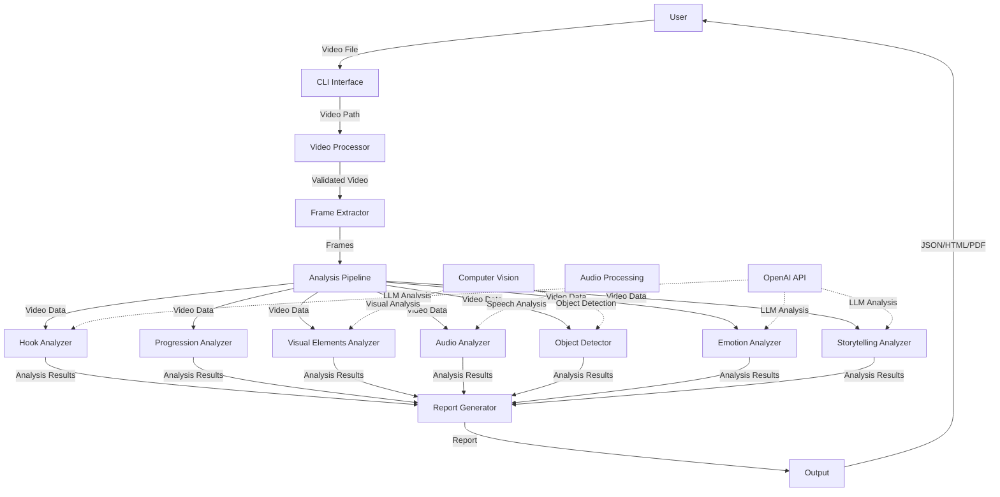
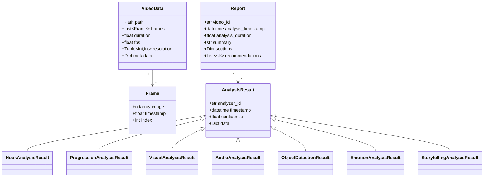
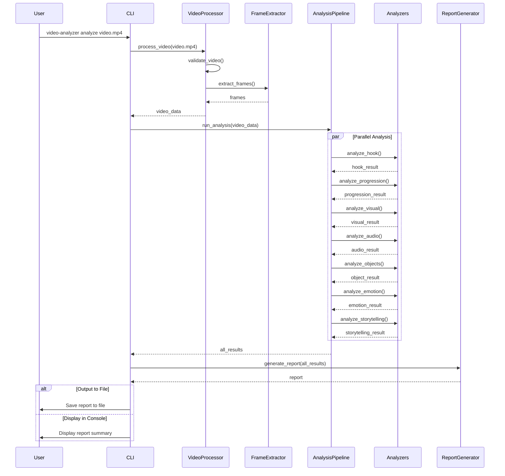
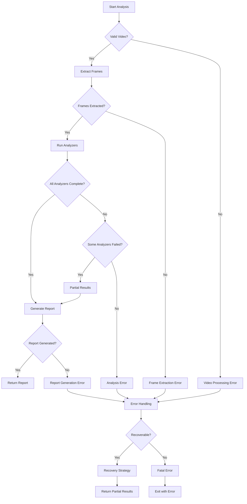

# Video Analyzer Data Flow

## System Architecture Diagram

## Detailed Data Flow

1. **User Input**

   - User provides a video file path via CLI
   - Optional parameters: output format, analyzers to use, etc.

2. **Video Processing**

   - Video Processor validates the file format and size
   - Video metadata is extracted (duration, fps, resolution)

3. **Frame Extraction**

   - Frames are extracted using the specified strategy:
     - Uniform: Extract frames at regular intervals
     - Scene Change: Extract frames at scene changes
     - Keyframe: Extract keyframes

4. **Analysis Pipeline**

   - VideoData object is created with video metadata and frames
   - Analysis tasks are created for each enabled analyzer
   - Tasks are executed in parallel or sequentially based on configuration

5. **Individual Analyzers**

   - Each analyzer processes the video data independently
   - Some analyzers may depend on results from other analyzers
   - External services (OpenAI API, computer vision) may be used
   - Progress is reported back to the pipeline

6. **Report Generation**

   - Analysis results are collected from all analyzers
   - Results are organized into sections
   - Summary and recommendations are generated
   - Report is formatted according to the requested output format

7. **Output**
   - Report is either displayed to the user or saved to a file
   - Output formats: JSON, HTML, PDF

## Data Models Flow

## Process Flow

## Error Handling Flow

